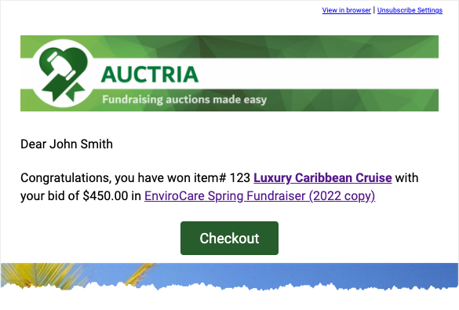
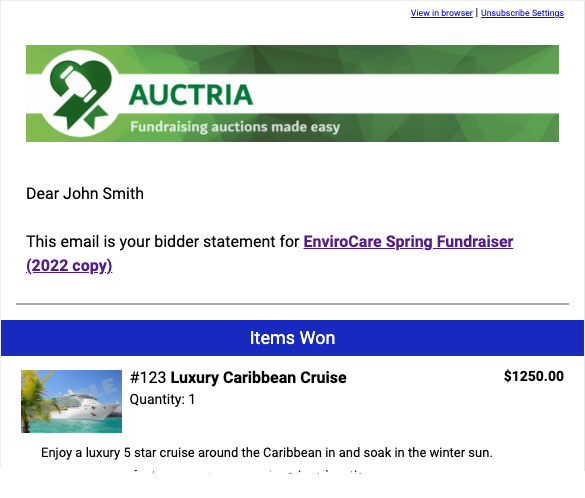
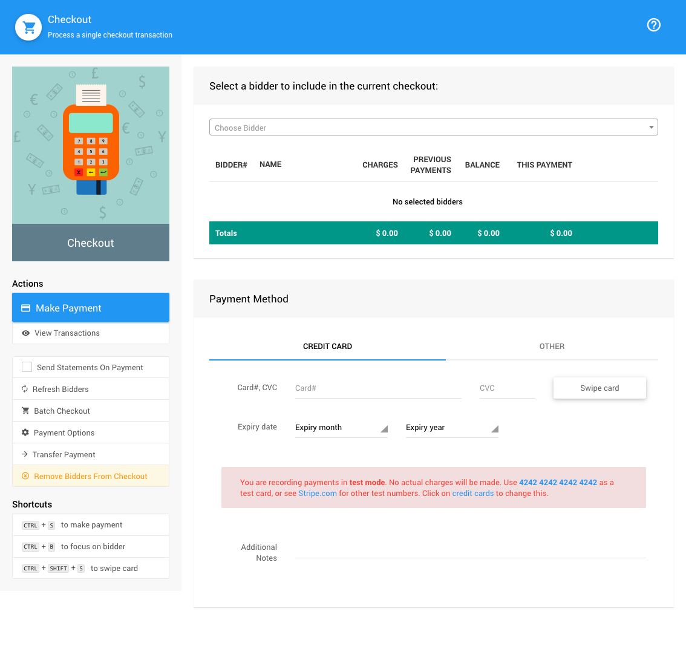
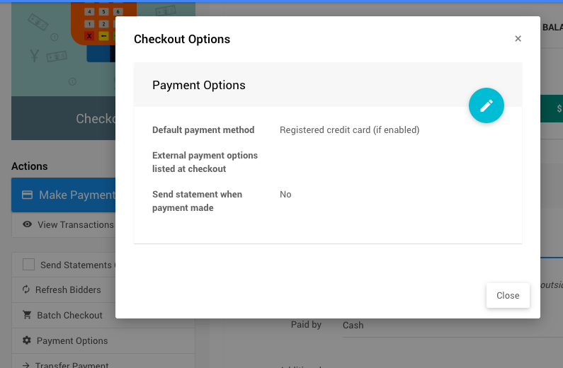
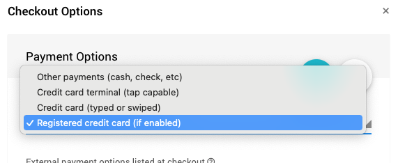
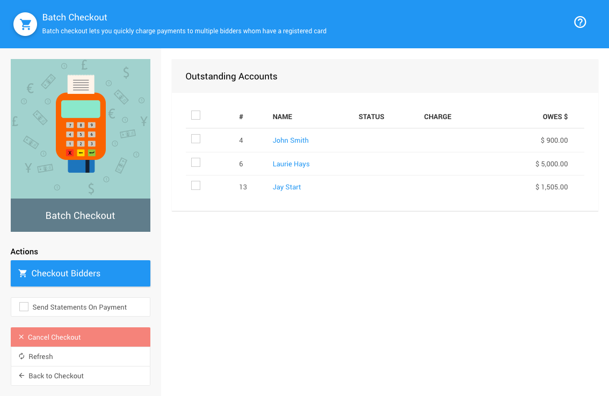
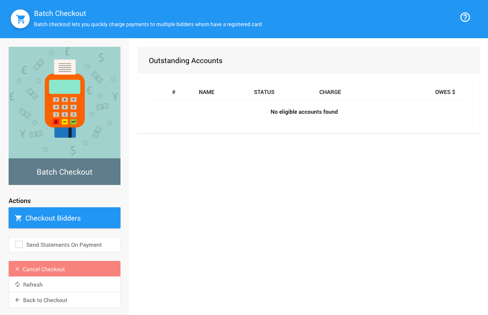
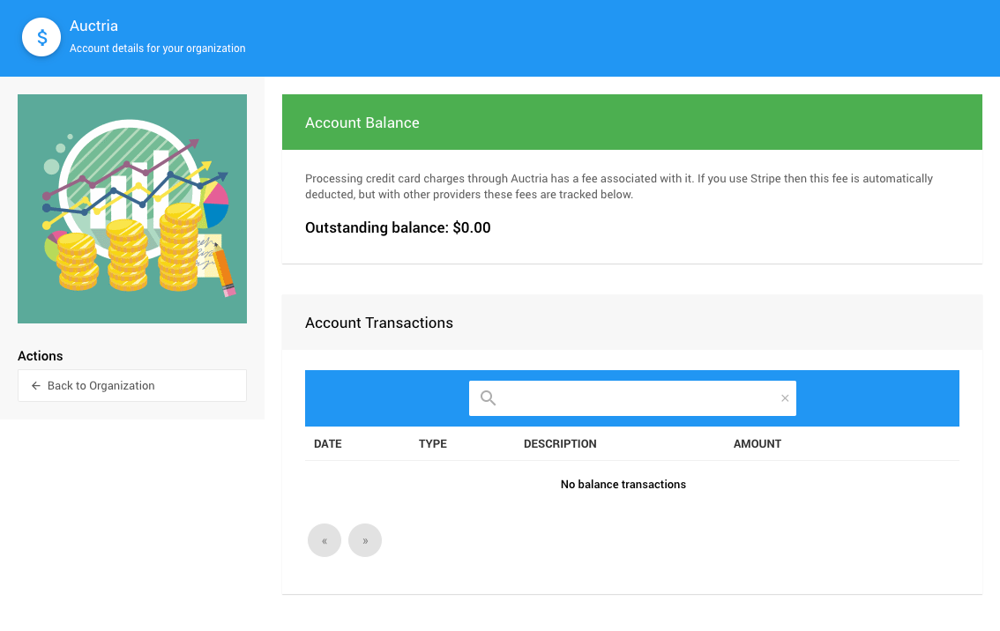

# Handling Payments <New/>

You can manually **Record Payments** by your winning bidders using the **Other** payment methods you allow although if you have **Credit Card** processing integration implemented you will also be able to provide your winners with the option to pay online through their respective **My Account** pages.

<HRDiv/>

  

    Handling Payments: Table Of Contents
  

  [[toc]]

<HRDiv/>

## Checkout Overview

Once the event is over and/or winning bids have been recorded, the **Checkout** processes can begin.

[comment]: # (“Video: Auctria Training: Checkout”)

<VimeoVideo video="651719483" date="2021-11-30"/>

<HRDiv/>

## Pay Online

If you have credit card processing enabled, the **Item Won Notifications** sent out for a winning bid will, by default, include a **Checkout** button.

::: middle
*An example of an __Item Won Notification__ (via the System Email "preview" option).*
:::

 The bidder can click on this button and pay their account balance via their **My Account** page. These transactions will automatically generate an appropriate **Bidder Statement** for their records.

 

 ::: middle
 *An example of a __Bidder Statement__ (via the System Email "preview" option).*
 :::
 &nbsp;

 <Linked slug="SystemEmailsSummary" anchor="online-bidding-item-won-time">Online Bidding: Item Won</Linked>
 <Linked slug="Checkout"/> 
 <Linked slug="MyAccount"/>
 <Linked slug="BidderStatements"/>

<HRDiv/>

## Manual Checkout

For any **Manual Checkout** operation, you would start from the main **Auction Dashboard** and click through the **Checkout** menu item.

::: info
By default, this operation will not send a **Bidder Statement** although you can enable this option as needed when recording the bidder payment.
:::

See the **Checkout** **_Actions_** <IndexLink slug="Checkout_RecordPayment"/> option for more information on this functionality.

<Linked slug="AuctionDashboard"/>
<Linked slug="Checkout"/>

### Checkout Payment Options

In many cases, especially for an **In-Person** event, you may be accepting **_Other_** forms of payment aside from a **Credit Card**. These options are set from under the **Checkout** dashboard **_Actions_** **Payment Options** settings. Clicking this menu item will pop open a window where these options are set. The default in many cases will be *Registered credit card (if enabled)*.

::: middle
*An example of the __Payment Options__  default pop-up window.*
:::

In general, it is best to set the **_Default payment method_** to be the one most likely to be used during the **In-Person** event to speed up the process of **Manually Checking Out** guests at the event.

::: middle
*An example of the __Default payment methods__ available for the __Checkout Options__.*
:::

See <IndexLink slug="CheckoutOptions"/> for more information on these settings.

<HRDiv/>

## Batch Checkout

The **Batch Checkout** function requires **Credit Card** processing integration be enabled **_and_** the **Bidders** being affected also have a **Registered Credit Card** **_on file_** for the event.

Although **Batch Checkout** can be run at any time it is often best to have waited for an appropriate amount of time after the event has ended allowing winning bidders to clear their **Outstanding Accounts** on their own. You can also check at any time what those **Outstanding Accounts** are and the amount owing for each.

See **Reports > Financial | <IndexLink slug="FinancialReports" anchor="accounts"/> > Outstanding Account** for more information.

If there are **Outstanding Accounts** with **Registered Credit Cards** on file, these bidders will be listed in the **Batch Checkout** dashboard.

::: middle
*An example __Batch Checkout__ dashboard with __Outstanding Accounts__.*
:::

See <IndexLink slug="BatchCheckout"/> for more information on this.

::: middle
*An example report showing __Outstanding Accounts__, with registered credit cards, __"Paid In Full"__.*
:::

::: info
Please note, an "empty" **Batch Checkout** list report means there are either no outstanding accounts **or** the outstanding accounts do not have a registered credit card on file. You can double-check with the **Reports > Financial | <IndexLink slug="FinancialReports" anchor="accounts"/> > Outstanding Account** report.
:::

<HRDiv/>

## Pay Credit Card Processing Fees

If you have enabled **Credit Card** processing within Auctria, and have taken payments with credit cards, there will be an **_integration fee_** charged. These **Credit Card Integration** fees are noted for each plan on [our pricing page](https://www.Auctria.com/pricing/).

::: green
**[Stripe](https://stripe.com)**
For **Stripe** payment processing integrations, these fees are taken care of during the processing of the transaction.
:::

::: yellow
**[Authorize.Net](https://authorize.net)**
For **Authorize.net** payment processing integrations, these fees are calculated from each **Credit Card** transaction and are displayed under the <IndexLink slug="AccountBalance"/> dashboard found under the <IndexLink slug="Organization"/> dashboard.
:::

If there is an **Outstanding balance** you owe for **Authorize.net** **Credit Card** transaction processing you will be able to pay that balance from this page.

<Linked slug="CreditCards"/>
<Linked slug="Stripe"/>
<Linked slug="AuthorizeNet"/>
<Linked slug="AccountBalance"/>

<HRDiv/>

## Confirm Transfer Of Funds

There are always important questions asked after a fundraiser. Two of the more commonly asked:

- **How much money was raised?**
  Please see the <IndexLink slug="IncomeSummary"/> table on the main **Auction Dashboard**.

- **When will the fundraiser income be transferred to our bank account?**
  Please see our FAQ <IndexLink slug="CreditCardFundsTransferred"/> for more information on this.
  ::: danger
  Auctria **_does not manage_** the **_transfer of funds_** to **your bank account**.
  :::

<HRDiv/>

::: recread
- <IndexLink slug="CheckoutOptions"/> for more details on "Other" payment methods.
:::

<ChildPages/>
<Revised text="Added" date="2022-01-14"/>
