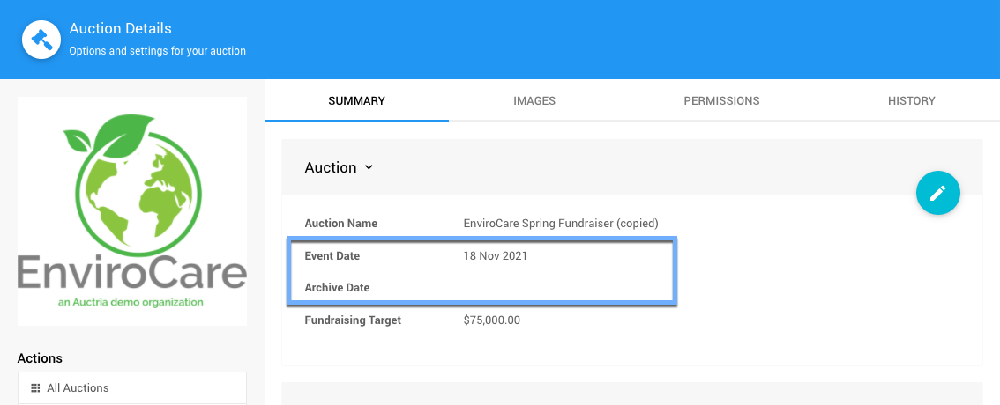

# Auction Wrap-Up <Updated/>

<VimeoCarouselShowcase showcase="9158850"/>

The **Auction Wrap-Up** part of your event does not always have a specific timetable to be followed, it might take place the night of the event or it happen once the dust has settled and you are closing out the event in preparations for your next fundraiser.

In most cases, your auction event is now over and it's time to start closing items, clearing outstanding balances, and archiving the Auction Website (plus any other tidying up that may be needed).

## Closing Items

One of the first things to consider when your auction event ends is closing out the items that were available. For your **Biddable** items, this will be mostly taken care of by the **Online Bidding Times** you have set. For **Biddable** items, bidding will be closed at their respective **Online Bidding End Times** although this is not the same with **For Sale** items and **Donation** items, these are managed differently.

For more information see <IndexLink slug="Walkthroughs_ClosingOnlineBidding"/>.

<Link/> <IndexLink slug="Glossary_BiddableItems"/>
<Link/> <IndexLink slug="OnlineBiddingTimes"/>
<Link/> <IndexLink slug="ForSaleItems"/>
<Link/> <IndexLink slug="DonationItems"/>

<HRDiv/>

## Checkout And Handling Payments

Once the event is over and the winning bids recorded, the <IndexLink slug="Checkout"/> processes begin.

[comment]: # (“Video: Auctria Training: Checkout”)

<VimeoVideo video="651719483" date="2021-11-30"/>

The **Checkout** processes will manage **Handling Payments**. With an **In-Person** event, this is often handled the night of the event. If the fundraiser was entirely **Online** or had an **Online** component to its bidding **_and_** you have **Credit Card** processing enabled, your bidders may have taken care of paying their balances via their **My Account** page as well.

For more information see <IndexLink slug="Walkthroughs_HandlingPayments"/>.

<Link/> <IndexLink slug="Checkout"/>
<Link/> <IndexLink slug="CreditCards"/>
<Link/> <IndexLink slug="MyAccount"/>

<HRDiv/>

## Archiving Your Auction

In general, the **Archive Auction** processes will be triggered approximately six (`6`) months after the **Event Date** set under **Auction Details**. This is often the date when the event was created.

::: middle
*An example of the __Auction Details__ from an Auctria demo event.*
:::

For the most part, you can leaves things as is and the **Auction Website** will be archived automatically.

For more information see <IndexLink slug="Walkthroughs_ArchivingYourAuction"/>.

<Link/> <IndexLink slug="ArchiveAuction"/>
<Link/> <IndexLink slug="AuctionDetails"/>

<HRDiv/>

## Last Steps

Celebrate! You have just finished a successful fundraiser. Well Done!!

Take a break and enjoy yourself... then start preparing for your next successful event with Auctria!

::: recread
- <IndexLink slug="AfterEventSales"/>, if you still have items left over from the event.
:::

<ChildPages/>
<Revised text="Reviewed" date="2022-02-15"/>
