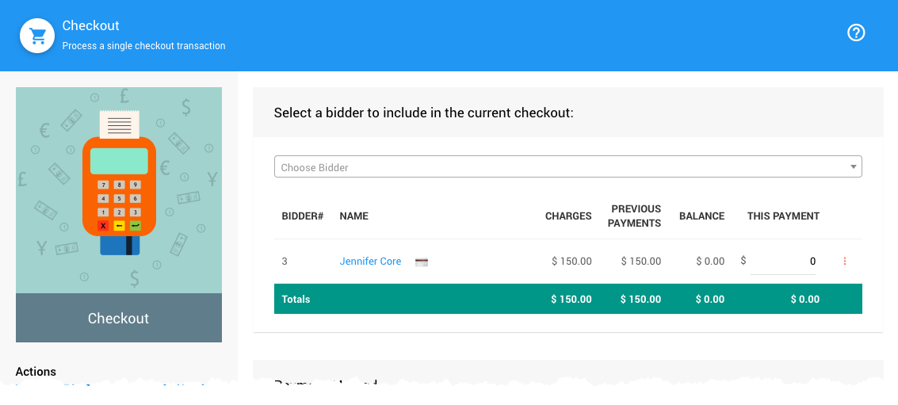
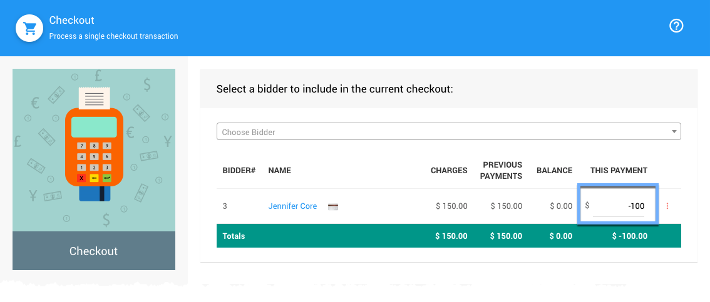
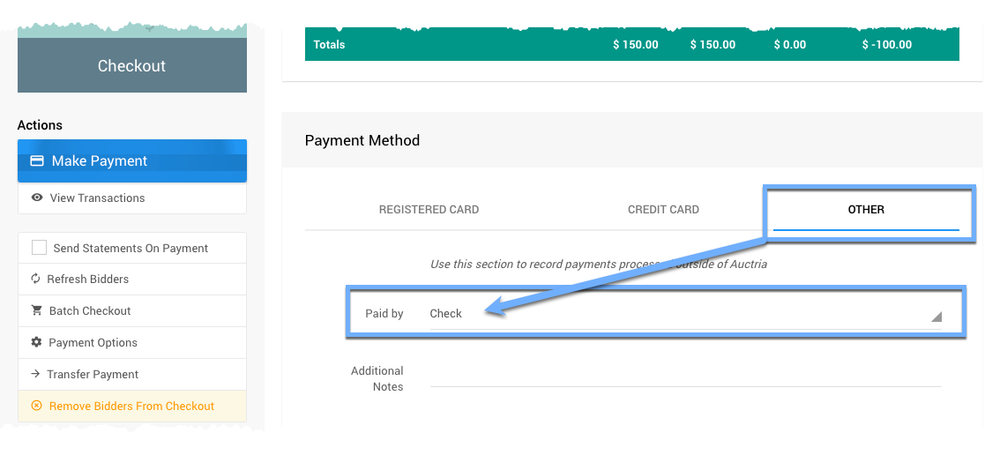
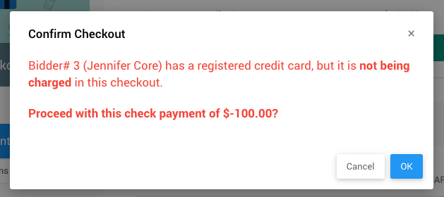

# Refund As A Negative Payment

There may be cases where a refund is required although it is not being charged back on a credit card transaction.

For example, a refund is required after the monies have been transferred from your credit card processing service to your fundraiser bank account and check needs to now be issued.

This would use the same processes as the default **Checkout** **_Make Payment_** *Action* although instead it would require a **Negative Payment**.

<HRDiv/>

  

    Refund As A Negative Payment: Table of Contents
  

  [[toc]]

<HRDiv/>

## Select The Bidder

In most cases, once you have the bidder selected they will have a `$0.00` balance to be paid, this is to be expected especially after an event has ended and the **Auction Wrap Up** has been completed.

::: middle
*An example of a bidder with a `$0.00` balance owing.*
:::

### Enter The Negative Amount

This is where the **_Refund_** amount is recognized. If a `$100.00` refund check is being issued then you would enter `-100` into the amount field.

::: middle
*An example of a negative amount (`-100`) entered for the payment.*
:::

<HRDiv/>

## Payment Method

Since this example **Refund** is being issued from the fundraiser bank account as a check, you should select the appropriate **Payment Method** to reflect this. In this case, you would be selecting the **_Other_** tab and choosing **Check** from its drop-down selector.

::: tip
Adding a relevant comment in the **_Additional Notes_** field may also be useful for this.
:::

<HRDiv/>

## Click Make Payment

Once the **Bidder** and **Payment Method** have been set, clicking the **Make Payment** button will start the refund process. A confirmation pop-up window with the details of the **_Payment_** will be dispalyed.

::: middle
*An example showing the details from above.*
:::

<HRDiv/>

## Update Activity Tab

::: info
Once a **Negative Payment** has been processed, the bidder account will be put out of balance and will be seen as an **Outstanding Account**. To correct this, an appropriate adjustment needs to be made to an **Activity** tab line item.
:::

If this was a **_Full_** **Refund**, the appropriate line item could be removed from the purchases or won items section of the **Bidder Activity** tab; or, the appropriate line item could also be removed from the **Item Activity** tab.

If this was a **_Partial_** **Refund**, the appropriate line item could be edited to have its amount reflect the non-refunded amount.

Once the **Activity** tab adjustment has been made the account should be back in balance.

<Linked slug="BidderDetails" anchor="activity">Bidder Details Activity</Linked>
<Linked slug="ItemDetailsActivity">Item Details Activity</Linked>

<ChildPages/>
<Revised text="Added" date="2022-01-27"/>
