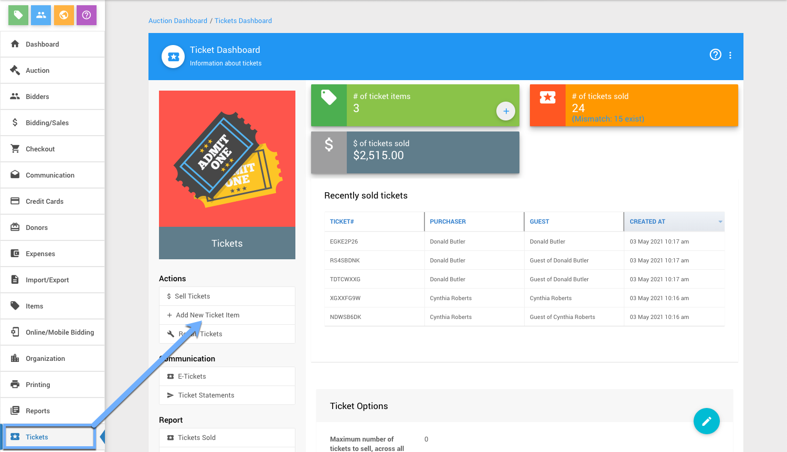
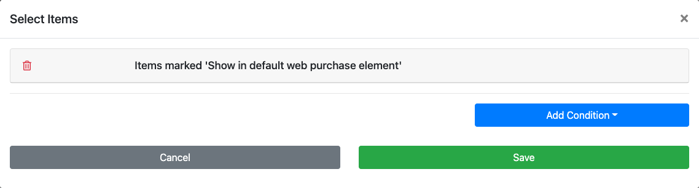
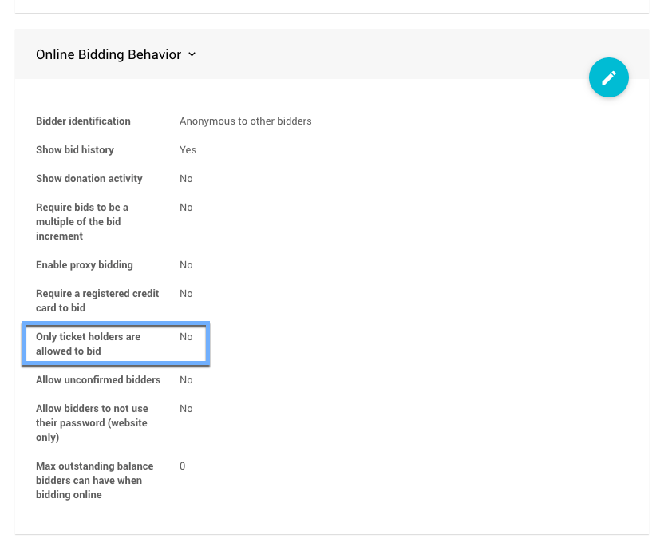

# How To Add Event Tickets To Your Website <NewLoc/>

The Auctria platform uses a dedicated <IndexLink slug="Tickets"/> item for admissions to the "in-person" event being held by the organization and as a bidding restriction option. The **Tickets** items themselves are specially configured <IndexLink slug="ForSaleItems"/> -- essentially the *Admission Tickets Included* value has been set.

To add **Tickets** to your auction website for your event: you will need to create **Tickets** items; and, choose a method to display those **Tickets**.

## Create Tickets

From the main <IndexLink slug="AuctionDashboard"/>, go to **Tickets** and then under the *Actions* sidebar menu choose the <IndexLink slug="CreateTickets"/> option.

The most common use for the **Tickets** item is for admission to an "in-person" event being held by the fundraising organization.

## Display Tickets

Once you have your **Tickets** created and have set any additional options you want to use with them, you will need to make them available to your potential guests to purchase.

### Ticket Sales Section

The most common approach to displaying tickets is to create their own page. There is a "Pre-built" <IndexLink slug="Section_AddSection" anchor="ticket-sales"/> section that helps to make this quick and easy.

::: middle
*An example passthrough creating a "Tickets" page and inserting the "Ticket Sales" Pre-built section.*
:::

- **Add New Page**
  The **Pre-Built Section** can be triggered as part of the <IndexLink slug="AddNewWebsitePage"/> function which also provides for a "Tickets" menu entry on your auction website main menu.
- **Add To Existing Page**
  Adding a new section (see <IndexLink slug="Section_AddSection"/> for more details) to an existing page will also allow you to insert the pre-built **Ticket Sales** section into that specific page.

### Item Catalog Configuration

The **Ticket Sales** section provides a pre-configured <IndexLink slug="RowContent_ItemCatalog"/> that uses the condition **Items marked 'Show in default web purchase element'** only.

::: middle
*The __Item Catalog__ uses a default __Tickets__ 'For Sale Items' option that is set when creating tickets.*
:::

The **Item Catalog** conditions can be further edited, see <IndexLink slug="ConfigureItemsDisplayed"/> for more information on how to make these changes, as needed.

<HRDiv/>

### Add Tickets To Existing Item Catalog <Advanced/>

Although often best to have **Tickets** be displayed on their own page, or with other **For Sale** items, you might also want to add them to an existing **Item Catalog**.

You can do this by re-configuring the conditions that are being used in the existing catalog following the information available on the <IndexLink slug="ConfigureItemsDisplayed"/> page.

::: yellow
**IMPORTANT**
Which conditions you would use for this approach will depend on several factors to ensure your **Tickets** items are displayed as well as maintaining the catalog's current contents.
:::

<HRDiv/>

## Required To Bid Option

An additional option built into Auctria requires bidders to have purchased a ticket before they are allowed to bid on any available items.

This "required to bid" option is available under **Online Bidding** <IndexLink slug="OnlineBidding" anchor="online-bidding-behavior"/> -- *Only ticket holders are allowed to bid*. The default for this option is **No** (or disabled).

<ChildPages/>
<Revised text="reviewed" date="2022-02-17"/>
