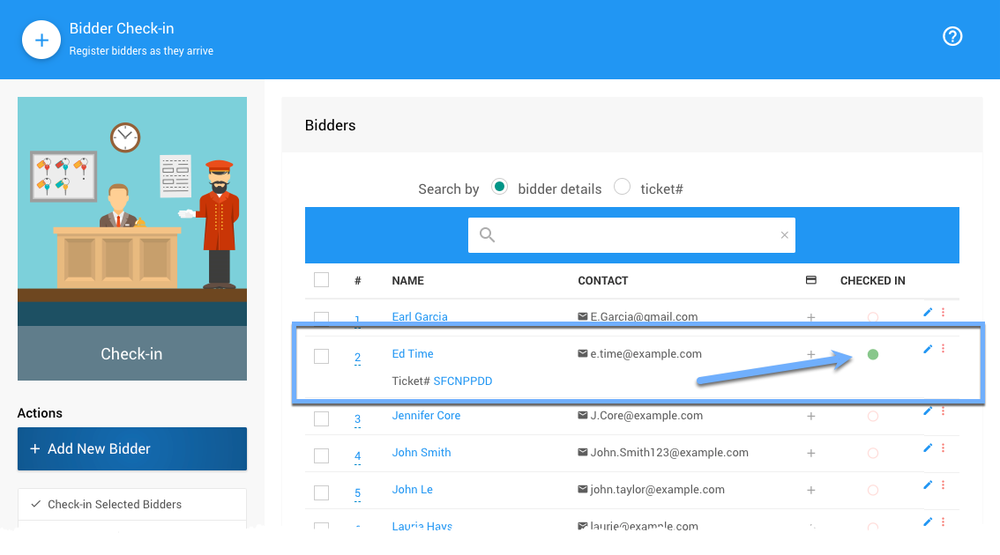

# Bidder Check-In And Registration <New/>

::: prereq
- **_Optional_**: **Credit Card Integration** enabled and ready to accept charges if selling tickets or other items "at the door".
  <Link/> <IndexLink slug="CreditCards"/>
:::

At **In-Person** events, you can use Auctria to **Check In Bidders** as they arrive; and, if they are not already registered for the event they can also be registered through the **Check-In** process by adding a new bidder; or, selling the guest a ticket, if needed, where the guest is registered and checked-in during that process.

[comment]: # (“Video: Auctria Training: Check-in”)

<VimeoVideo video="651720944" date="2021-11-30"/>

<HRDiv/>

  
Bidder Check-In And Registration: Table of Contents

  [[toc]]

<HRDiv/>

## Bidder Check-In

::: middle
*An example of a __Bidder Dashboard__ using Auctria demo data.*
:::

From the main **Auction Dashboard**, click through **Bidders > Check-in Bidders** under the **_Actions_** sidebar menu to open the **Bidder Check-in** dashboard.

::: middle
*An example of the __Bidder Check-in__ dashboard using Auctria demo data.*
:::

Select the bidders you want to **Check-in** by clicking on the checkbox beside their name and then click **Check-in Selected Bidders**.

::: info
You can search for bidders by entering details such as their last name or a ticket number to find the bidder you want to check in.
:::

After the bidders have been checked-in, they will show as such on the **Bidder Check-in** dashboard.

::: middle
*An example of a checked-in bidder, with the green dot under __Checked In__ column.*
:::

<HRDiv/>

## Bidder Registration

If the bidder is not in the system, click the **Add New Bidder** button under **Actions** sidebar.

::: info
This action will only register the guest for the event, it will not provide for any additional options selling a ticket to the guest may include.
:::

As part of the **Add New Bidder** process, you can also **Check-in** the bidder as you register them by checking the **_Checked in?_** box. Clicking the **Save Bidder** button will update/add the guest as a bidder and return you to the main **Bidder Check-in** dashboard page.

<HRDiv/>

## Sell Tickets

::: prereq
- To **Sell Tickets** you will need to have created <IndexLink slug="Tickets"/> items first.
:::

If your event is ticketed, meaning guests need to purchase a ticket for admission to the **In-Person Event** or as a requirement to bid, you can use the **Sell Tickets** option under the sidebar **_Actions_** menu.

::: info
The guest **_must be registered first_** to use this **Sell Tickets** function from the **Bidder Check-In** dashboard.

You can also use the **Sell Tickets** function from under the **Tickets** menu via the main **Auction Dashboard** although this option will not **Check-In** the bidder.

<Link/> <IndexLink slug="SellTickets">Tickets > Sell Tickets</IndexLink>
&nbsp;
:::

Using the **Sell Tickets** function from the **Bidder Check-In** dashboard will pre-populate the **Sell Tickets** form field with the selected bidder's details as the purchaser of the ticket.

::: middle
*An example where a bidder has been selected you want to sell a ticket to.*
:::

::: middle
*...continuing with the example above showing the __Sell Ticket__ dashboard page.*
:::

::: red
**WARNING**
You can only sell tickets to one bidder at a time. Selecting multiple bidders will produce a warning message with a reminder of this.
:::

Once you have clicked on **Record Sale** under the **_Actions_** sidebar, the bidder will be registered for the event. This function does not **Check-in** the bidder.

To return to the **Check In** dashboard from the **Sell Ticket** dashboard, click on the **_Actions_** | **_Menu_** sidebar button for **Check-in Bidders** and continue with your bidder check-ins as needed.

<HRDiv/>

## Actions

There are more **Actions** you can take on the **Bidder Check-In** dashboard page.

### Send Access Token

The **Send Access Token** function requires you select the bidder(s) first then clicking the button will initiate the **Bidder Access Tokens** function to send an appropriate email to the selected bidders.

<Link/> <IndexLink slug="BidderAccessTokens"/>

### Link Selected Bidders

If you wish to **_Link_** two bidders when they are checking in, simply check the appropriate box beside each bidder and then click the **Link Selected Bidders** **_Actions_** button.

<Link/> <indexLink slug="LinkMergeBidders"/>

### Unlink Selected Bidders

The **Unlink Selected Bidders** will separate the bidders and create an appropriate bidder record for each of the newly unlinked bidders beyond the first bidder record (as set by the Bidder number).

The unlinked bidders will have **Bidder Numbers** assigned based on your configuration choices with the default being to add an automatically generated number following the **_Next assigned bidder#_**.

<Link/> <IndexLink slug="Concepts_BidderNumbers" anchor="assigning-bidder-s">Bidder Numbers | Assigning Bidder#'s</IndexLink>

### Refresh Bidders

The **Refresh Bidders** function is most useful when there are multiple **Users** working with the **Check-in** dashboard to keep the data being viewed current or when online ticket sales are still available for the event and guests may be purchasing them just prior to checking in at the event.

### Options <Advanced/>

Clicking the **Options** action will open the **Check-in Options** popup window.

This will allow you to add **Additional bidder fields to show in check-in list** as a comma separated list of bidder fields to show on the check-in page. See <indexLink slug="TemplateBidder"/> for a list of fields. Also to note, the intent is for "simple fields" to be used here such as `Notes` or `Company` for example.

::: info
Added **Options** fields may not show up without **_refreshing_** your browser.
In rare cases, it may take a few minutes for caches to clear.
:::

### Assign Seating

Clicking the **Assign Seating** action will open the **Seating Assignment** page.
See <IndexLink slug="AssignSeating"/> for more information.

<HRDiv/>

## Edit Bidder Details

If you want to edit bidder information at check-in or check the table assignment or address, click the **Quick Actions** icon (3 vertical dots icon at the far-right of the bidder row) and then select **Edit Bidder**.

Note that you can also delete a bidder and view bidder details from these **Quick Actions**. If you select view details, you will open the Bidder window for that bidder.

::: middle
*An example showing the available __Quick Actions__.*
:::

If you selected **Edit Bidder**, a popup window will appear that allows you to edit the bidder details.

::: middle
*An example __Edit Bidder__ pop-up window.*
:::

You can make any changes, as needed, and then click the **Save** button at the bottom of the popup window to save your changes. Clicking the **Cancel** button will discard your changes and/or close the popup window without saving.

<ChildPages/>
<Revised text="Added" date="2021-12-20"/>
