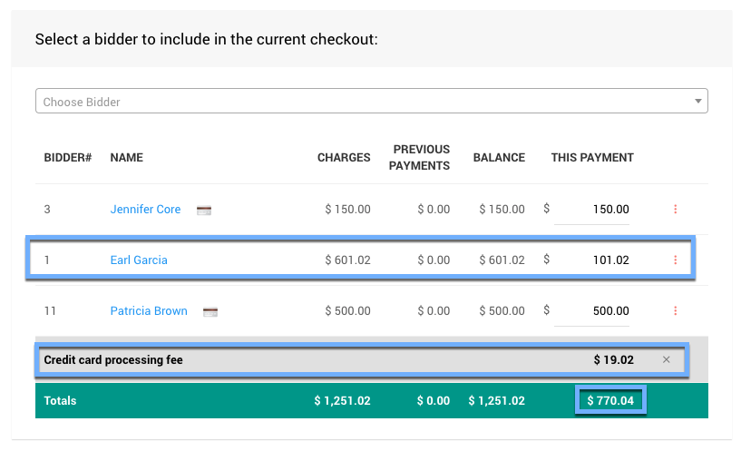

# In-Person Checkout And Payments <New/>

In its simplest form, especially when using the **Checkout** functions at an **In-Person Event**, you will be essentially following three steps:

1. [Select The Bidders For the Payment](./#select-bidders)
2. [Select The Payment Method](./#select-payment-method)
3. [Click The _Make Payment_ Button](./#click-make-payment)

::: prereq
- **(Optional)** <IndexLink slug="CreditCards">Credit Card Processing Integration</IndexLink> (**strongly recommended**)
:::

[comment]: # (“Video: Auctria Training: Checkout”)

<VimeoVideo video="651719483" date="2021-11-30"/>

  
Checkout And Payments: Table Of Contents

  [[toc]]

<HRDiv/>

To access the **Checkout** functions, click through **Checkout** on the main **Auction Dashboard** menu.

## Select Bidders

::: middle
*Default __Choose Bidder__ section before selecting a bidder.*
:::

### Single Bidder

A **Single Bidder** can be selected using the **_Choose Bidder_** drop-down selector. If you start typing into the field it will auto-populate with a list of matching bidders for you to select from.

::: middle
*An example of a bidder list using Auctria demo data.*
:::

Once a bidder is selected, they will be shown as a line item for the payment being made.

::: middle
*An example bidder with a balance using Auctria demo data.*
:::

The bidder listed will have:
- a link to their **Bidder Record** (by clicking through their name);
- if they have a **Registered Credit Card**, a credit card icon will be shown beside the bidder name;
- columns for *Charges*, *Previous Payments*, and *Balance* will have current event values; and,
- the *This Payment* column will default to the current *Balance* amount.

### Multiple Bidders

If there will be multiple bidders involved in the payment being made, they can be added in the same fashion as adding a single bidder.

::: middle
*An example of a list of multiple bidders selected for the payment using Auctria demo data.*
:::

Each listed bidder will have their specific details associated with them as a single bidder; and, the **Total** line for the list will include the sum of each column.

### Credit Card Fees

By default, the **Credit Card Surcharge Settings** options will allow the "credit card fees" to be added to the payment being made.

Clicking the *Add in credit card fees...* button will add an additional line item for the fees.

::: middle
*An example of the __Credit card processing fee__ added to the payment being made.*
:::

::: middle
*Remove the __Credit card processing fee__ by clicking on the `X` at the far-right.*
:::

::: info
The total **Credit card processing fee** will be based on the total of the **This Payment** column.
:::

::: recread
- <IndexLink slug="CreditCardSettings" anchor="surcharge-settings-current-auction">Credit Card Settings | Surcharge Settings (Current Auction)</IndexLink>
:::

### Partial Payments

Although the default payment amount will always be set to equal the current bidder balances. To make take a **Partial Payment** from a bidder, you would simply change the specific **This Payment** amount to the amount you are accepting for that specific bidder record.

::: middle
*An example of a changed __This Payment__ amount.*
:::

Changing a **This Payment** amount will automatically recalculate all affected values, such as the **Credit card processing fee** and the Total of the **This Payment** column.

::: info
This is the only place in Auctria where a **Partial Payment** can be made.
Bidders cannot make a **Partial Payment** online, only the full amount is accepted.
:::

<HRDiv/>

## Select Payment Method

Once you have your **Selected Bidders** listed for the payment and decided if you are are including the **Credit card processing fee** your next step is to **Select The Payment Method** being used.

::: middle
*An example of the default __Payment Method__ section based on the examples above.*
:::

The available **Payment Methods** will be based on on if one of the listed bidders has a registered credit card on file, if credit card processing is enabled, and what additional options have been provided for via the **Checkout Payment Options** settings (the **Other** tab).

In these cases, you will see a **Registered Card**, **Credit Card**, and **Other** tab to select from. By default, if a **Registered Card** is available it will be selected.

<Link/> <IndexLink slug="CreditCards"/>
<Link/> <IndexLink slug="Concepts_RegisteredCards">Registered Credit Cards</IndexLink>
<Link/> <IndexLink slug="CheckoutOptions"/>

### Registered Card

The **Registered Card** selected, by default, will be the first one in the list of selected bidders.

To change the selected **Registered Card** being used for the payment, click on the bidder name in the **Registered Card** tab to open a selector showing the available bidders with registered credit cards in the payment list.

::: middle
*An example based on the current selected bidders from the Auctria demo data.*
:::

Clicking on the appropriate bidder in the list will change the **Registered Card** being used to the one they have on file; and, all changes will be applied to their credit card.

::: yellow
**IMPORTANT**
If there are multiple **Registered Cards** available from the list of bidders, the selected credit card will be the only one charged for the total of the **This Payment** column.
:::

### Credit Card

&nbsp;
::: prereq
- <IndexLink slug="CreditCards">Credit Card Processing Integration</IndexLink> 
  (**required, not optional in this case**)
:::

::: middle
*An example of the __Credit Card__ tab while in __Test__ mode for an event.*
:::

If you are accepting a credit card for payment (and have credit card processing integration enabled), you can enter the appropriate details into to record the credit card the bidder wants to use.

::: info
For faster "date entry" only, you might consider getting <IndexLink slug="CardReaders"/> for the **Swipe card** button. Using the **Card Reader** and the **Swipe card** button will fill in the credit card details on this tab. **_This will not charge the credit card_**.
:::

### Other

The **Other** payment method tab uses the options set up under **Checkout Payment Options**. The default options of *Cash*, *Check*, and *Other* are provided for convenience although you can add more as needed. Selecting one of the options available option or using the default *Cash* will be applied as the payment method.

<Link/> <IndexLink slug="CheckoutOptions"/>

<HRDiv/>

## Click Make Payment

Once the **Bidders** have been selected (with any **_This Payment_** adjustments) and the **Payment Method** has been set, the next step is generally going to be clicking the **Make Payment** button.

When you click the **Make Payment** button a **Confirm Checkout** popup will be displayed.

::: middle
*An example confirmation with a summary of the payment being made.*
:::

Click the **OK** button to confirm the **Checkout** you are working on. A processing payment popup followed by a success message will be displayed and the **Checkout** dashboard will be refreshed showing the current bidders with their updated totals.

**_Well Done!_** You're ready for the next person in line to **Checkout**!

### Recently Checked Out

::: middle
*Taken from the above examples, a __Recently Checked Out__ list.*
:::

After you have checked out your bidders, you will also have a **Recently Checked Out** list at the bottom of the **Checkout** dashboard page. Each bidder will have a convenient link under their name to either *Print* or *Email* their **Bidder Statement** as needed.

<HRDiv/>

::: recread
- The <IndexLink slug="Checkout"/> section, in general, is a great follow-up to this walkthrough page.
:::

<ChildPages/>
<Revised text="Added" date="2021-12-22"/>
