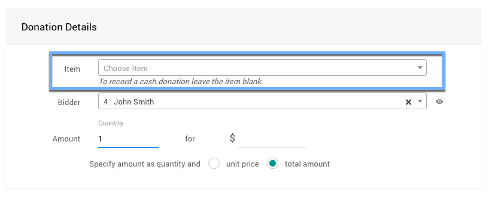
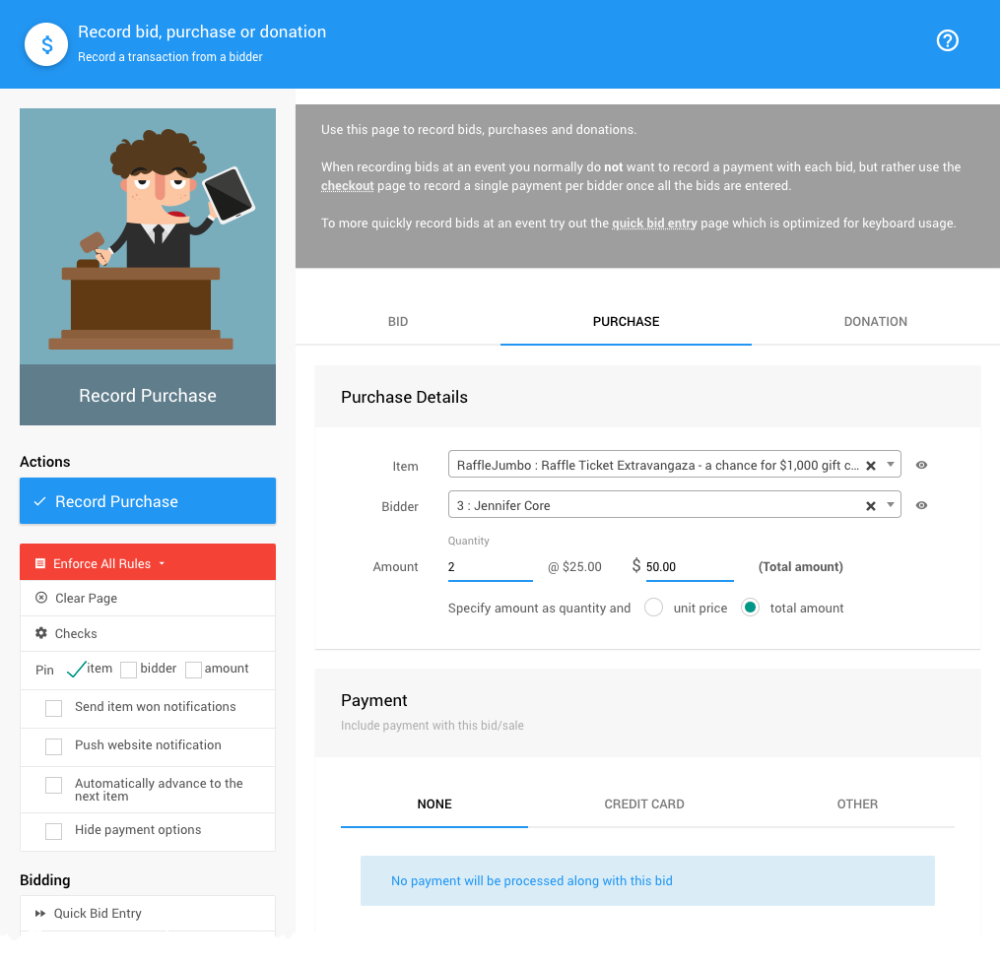

# Recording Bids, Purchases, And Donations <New/>

::: middle
*The __Record bid, purchase or donation__ dashboard.*
:::

You open the **Record bid, purchase or donations** dashboard from the main **Auction Dashboard** by clicking the **Bidding/Sales** menu item.

  

    Bids, Purchases, And Donations: Table Of Contents
  

  [[toc]]

## Recording Bids

The **Record Bid** tab provides for finding the item being bid on by its **Item#** (or its **Live#**). During an **In-Person** event this is often the easiest and fastest way to locate the item.

### Choose Item

::: middle
*An example selecting an item from the Auctria demo data.*
:::

The **_Item_** field will start to auto-populate matching items when you start typing in the item number.

Once an **_Item_** has been selected, the selector will close and the focus will be shifted to the **_Bidder_** field. Looking up the bidder is very similar to looking up an item.

### Choose Bidder

::: middle
*An example selecting a bidder from the Auctria demo data.*
:::

The **_Bidder_** field will start auto-populating with matching results as you type. You can use letters or numbers as the *Bidder Number* and the *Bidder Name* will be searched for matching results.

Once the **_Item_** and **_Bidder_** have been selected you can continue with entering the **_Amount_** details.

### Enter Amount

::: info
The __Amount__ field portion will dynamically change to match what you are recoding on the **Record bid, purchase or donations** dashboard.
:::

In the case of **Recording Bids**, you will also be presented with the option to make the bid a **_Final Bid_** (closing bidding and awarding the item to the bidder) or have their bid recognized as a **_Proxy Bid_** and the system will manage the bidder's future bids on the item up to their "maximum bid" amount.

<Link/> <IndexLink slug="RecordBid" anchor="final-bid"/>
<Link/> <IndexLink slug="ProxyBidding"/>

<HRDiv/>

## Recording Purchases

The **Record Purchase** tab uses a very similar layout and approach as the **Record Bid** tab ([above](./#recording-bids)).

You would use the **Choose Items** field to select the item being purchased and then select the **Bidder** that will be purchasing the item. See [Choose Item](./#choose-item) and [Choose Bidder](./#choose-bidder) above for more details.

::: middle
*An example __For Sale__ item and bidder selection from the Auctria demo data.*
:::

::: red
**WARNING**
The **Record Purchase** function is **_not_** meant to be used for selling **Tickets**. The purchaser will not be properly registered with their tickets unless you use the **Sell Tickets** function from the **Auction Dashboard** under the **_Tickets_** section.
<Link/> <IndexLink slug="Tickets"/> <Link/> <IndexLink slug="SellTickets"/>
&nbsp;
:::

### Purchase Amounts

With the **_Item_** and **_Bidder_** selected, the default for the **_Amount_** will be the value of a single quantity of the item based on the *total amount*.

Changing the quantity will automatically calculate and update the amount fields.

Changing to the *unit price* option allows you to set a different *unit price* than what the **Item Details** **_Value_** has been set at.

::: recread
- <IndexLink slug="ItemValues"/>
:::

<HRDiv/>

## Recording Donations

The **Record Donation** tab uses a very similar layout and approach as the **Record Bid** tab ([above](./#recording-bids)). The general functionality of the **Record Donation** tab is very similar to the **Record Purchase** tab ([above](./#recording-purchases)).

In general, you would select a **Donation** **_Item_** and a **_Bidder_** to record their donation with the same **_Amount_** options as the **Record Purchase** tab ([above](./#purchase-amounts)).

::: middle
*An example __Donation Item__ and __Bidder__ taken from Auctria demo data.*
:::

There is also the option to record a **_Cash_** donation under the **Record Donation** tab by not selecting an **_Item_** (using an empty **_Item_** field).

::: yellow
**IMPORTANT**
A **Cash** donation will not be specifically assigned to any particular project for the fundraiser. If you need to know where the donations are targeted for it is best to use **Donation** items and select an appropriate item when recording donations.
:::

<Link/> <IndexLink slug="DonationItems"/>

## Record Payment With Transaction

When you **Record bids, purchases or donations**, the default payment method selected is **None**.

This means, by default, the dollar amount being recorded will be applied to the **Bidder** record and be an outstanding balance on their account.

::: info
The **Record Bid** tab would only use the **Payment** section if the bid being recorded is a **_Final Bid_**.
:::

To just record a bid only, keep the **NONE** option; otherwise, to record a payment select either the **Credit Card** tab or the **Other** tab (or the **Registered Card** tab, if available).

### Enter payment

When recording a purchase you may also want to record that it has been paid.  For example, if you are entering purchases made prior to the event, you may wish to record pre-payment. To enter payment details with a purchase or donation, see <IndexLink slug="IncludePaymentWithBid" />.

<Link/> <IndexLink slug="CheckoutOptions">Payment Options</IndexLink>

<HRDiv/>

## Sidebar: Actions

At the top of the **Sidebar: Actions** menu is a dynamic blue button for recording the bid, purchase or donation. It will match the tab on the dashboard that is being viewed.

### Enforce All Rules

Clicking this opens a drop-down selector to choose if/when bid rules are applied.
- Enforce All Rules (default)
- Suppress All Rules
- Suppress Once

### Clear Page

This clears all of the current information from the fields on the screen.

### Checks

Clicking this will open the "Bidding Checks" window. These are the rule values being used for the **Enforce All Rules** options.

::: middle
*The default __Bidding Checks__ rule values.*
:::

- **Check bid values against the starting bid** (default: `Yes`) will ensure the recorded bid is equal to or greater than the **Starting Bid** value.
- **Check bid values against the bid increment** (default: `No`), if enabled, will ensure the bid is a multiple of the **Bid Increment** value (plus the **Starting Bid** value).
- **Bid value warning multiplier** (default: `1.33`) will provide a warning for bids entered much higher than the current winning bid.
- **Check if the bidder has a registered card** will check if the bidder has a registered credit card on file. This is used with the **Require A Registered Credit Card To Bid** option under **Online Bidding Behavior**.
  <Link/> <IndexLink slug="Concepts_RegisteredCards" anchor="require-a-registered-credit-card-to-bid"/>
  <Link/> <IndexLink slug="OnlineBidding" anchor="online-bidding-behavior">Online Bidding | Online Bidding Behavior</IndexLink>

### Pin

To quickly record multiple bids you can "pin" the item, bidder, or amount.
See <IndexLink slug="Pinning"/> for more information.

### Additional Options

- **Send item won notification**
  Enabling this will generate and send a winning bid notification to the bidder.
- **Push website notification**
  This send a pop-up notification to the Auction Website.
- **Automatically advance to the next item**
  Enabling this will advance to the next item# after recording the transaction.
- **Hide payment options**
  Enabling this option will hide the **Payment** section.

## Sidebar: Bidding

- **Quick bid entry** <Link/> opens the <IndexLink slug="QuickBidEntry"/> page.
- **Open/Close Bidding** <Link/> <IndexLink slug="OpenCloseBidding"/> page.
- **Validate Bids** <Link/> opens the <IndexLink slug="ValidateBids"/> page.

## Sidebar: Website

- **Online Bidding** <Link/> opens the Website <IndexLink slug="OnlineBidding"/> page.

## Sidebar: Shortcuts

If you are entering many bids at once, using the keyboard shortcuts for this dashboard may save time.

`CTRL` + `S` to record bid
`CTRL` + `B` to focus on bidder
`CTRL` + `I` to focus on item
`CTRL` + `A` to focus on amount
`CTRL` + `Q` to focus on quantity

<HRDiv/>

::: recread
- <IndexLink slug="BiddingSales"/>
:::

<ChildPages/>
<Revised text="Added" date="2021-12-21"/>
