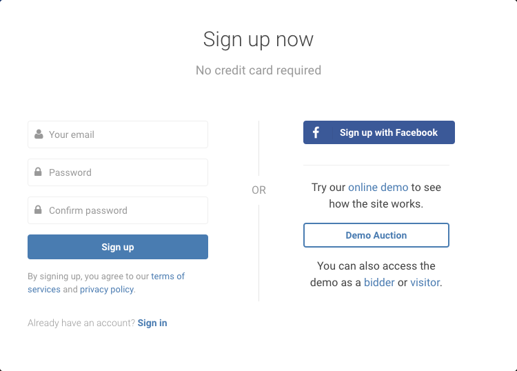
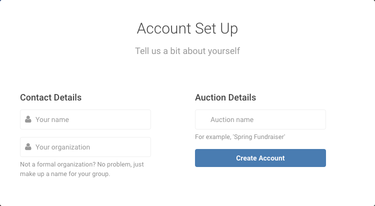
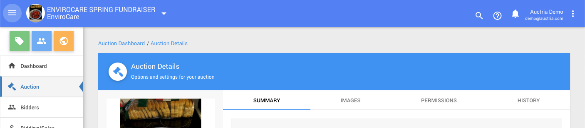

# Initial Setup

<VimeoCarouselShowcase showcase="6704967"/>

<HRDiv/>

If you have not used Auctria for an event before you will need to start by signing up for an account.

## Organization Setup

All auctions/events in Auctria belong to an **Organization**.

When setting up your account, you were prompted for some details about your **Organization**.

You can review or change this information under the main **Auction Dashboard** menu using the **Organization** link. See **Organization Details** for more information on this.

::: info
Your email address can be associated with multiple Organizations providing the opportunity of **Switching Organizations** as needed.
:::

::: yellow
**IMPORTANT**
You will receive an email at the address you provided which will **need to be confirmed** to completely set up your new organization/email address account.
:::

<Linked slug="Organization"/>
<Linked slug="OrganizationDetails"/>
<Linked slug="SwitchingOrganizations"/>
<Linked slug="AuctionDashboard"/>

<HRDiv/>

## Auction Setup

::: info
Auctions are created *within* an **Organization**; and, each **Organization** can have multiple auctions/events associated with it.
:::

Some basic details about your auction/event would have been entered when you were filling in your initial account information during the setup such as the Auction name. You can update these details by following the **Auction** link in the main **Auction Dashboard** menu.

Also see **Auction Details** and **Auction Permissions** for more in-depth information.

<Linked slug="AuctionDashboard"/>
<Linked slug="Auction"/>
<Linked slug="AuctionDetails"/>
<Linked slug="AuctionPermissions"/>

<HRDiv/>

## Users

**Users** are individuals with access to the administration side of your auction and may help add items, register bidders, record bids, run checkout, etc. If you need to add **Users** to help with organizing your event you would use the **Adding Users** functions and set their appropriate **User Permissions**.

::: yellow
**IMPORTANT**
The number of **User Accounts** is limited by the current subscription plan.
Please visit our [Auctria Online Store](https://www.auctria.com/pricing/) website page for more information on plan features.
:::

::: ideas
We recommend having/creating an *Administrator* **User Account** that is readily accessible by the "Organization" in case the current "administrator(s)" move on to other projects. This is not a requirement although it does help to future-proof the organization and access to its management functions.
:::
&nbsp;

<Linked slug="AddUser"/>
<Linked slug="UserPermissions"/>

<HRDiv/>

## Items

Items are crucial to all events in Auctria and one of the first tasks is to **Add Items** you will be offering your guests at the auction, or for sale from the **Auction Website**.

<Linked slug="AddNewItem"/>

::: yellow
**IMPORTANT**
When you create items, you **must** set the item to be one of the Auctria **Item Types**. The default will be to use the **Online** item type.
:::

The Item Types are **pre-set** by Auctria with **specific functionality** assigned to each type. Before you set up your items, it is best to understand the different items types.

::: green
**NOTE**
The item type can be changed at any time. This may change how Auctria handles the item. Please remember to double-check the item is behaving as expected if you do change its type. Please read more on **Item Types** for more information on this.
:::

::: recread
- The <IndexLink slug="IntroductionToItems"/> page provides helpful information about **Items** and their **Types** in Auctria.
- Review <IndexLink slug="ItemTypes"/> for more information on how these affects **Items**.
:::

<HRDiv/>

## Auction Event Website

In today's digital world, having a website for an event is just a matter of course. Auctria provides the tools for you to quickly and easily generate a website for your auction and once you settle on your items the next step should be getting your website published and start letting your potential donors, bidders, and sponsors know about your event.

Have a look at the <IndexLink slug="Walkthroughs_CreateNewWebSite2021"/> walkthrough to start the ball rolling.

<HRDiv/>

## Additional "Initial Setup" Steps

Setting up the Organization and Auction as well as settling on items and publishing a website are essentially all you need to really get started although there are still many features Auctria offers to make your event that much better for you as well as your guests.

### Credit card processing integration (optional)

Auctria offers **Credit Card** processing integration with a recommendation for using [Stripe.com](https://stripe.com). For more details on this (as well as details for using **Authorize.Net**), please read our **Credit Cards** main section of the User Guide and especially the page about **Connecting A Stripe Account**.

<Linked slug="CreditCardConcepts">Concepts - Credit Cards</Linked> 
<Linked slug="CreditCards">Credit Cards (main)</Linked>
<Linked slug="StripeConnection"/>

### Add More Checkout Payment Options (optional)

Another thing to consider when setting up the Organization and Auction is how will bidder, donors, and sponsors being "paying" for their contributions. In some cases, the default *Cash*, *Check*, and *Other* options may not be enough. If you think this might be your case, too, have a look at the <IndexLink slug="CheckoutOptions"/> page for more details.

### Text Messages (optional)

Almost everyone has a mobile device, and most of those guests will understand and often use **Text Messages**. Auctria provides an option to allow you to give this to your bidders. Aside from our free **Mobile App**, bidders would have the opportunity to just text in their bids, registration, donations, etc.

::: info
The **Text Messages** feature set is **_included_** with **Emerald** and **Diamond** subscription plans. To start, begin with <IndexLink slug="TextingSetUp" anchor="assign-phone-number">Texting Set Up - Assign Phone Number</IndexLink>.
:::

::: recread
Learn more about the *commands* currently available under <IndexLink slug="TextCommands"/> in our <IndexLink slug="TextMessages"/> section of our User Guide.
:::

<HRDiv/>

## Checklists

Feel free to view and use our checklists we reference in the article [Auctria Timeline & Checklist](https://www.auctria.com/blog/auction-timeline-checklist/).

<HRDiv/>

<ChildPages/>
<Revised text="Reviewed" date="2022-02-15"/>
