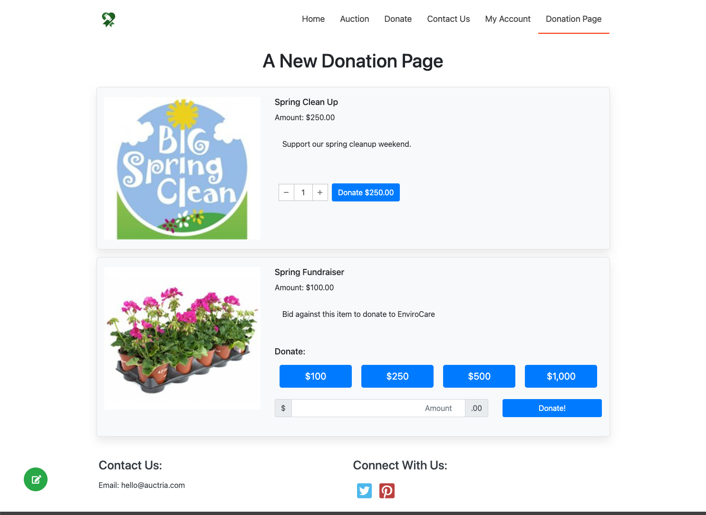
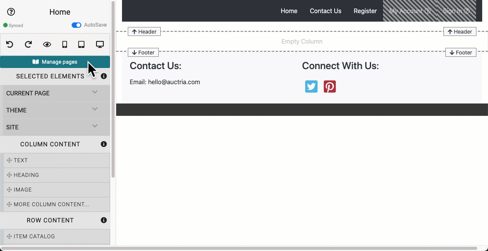
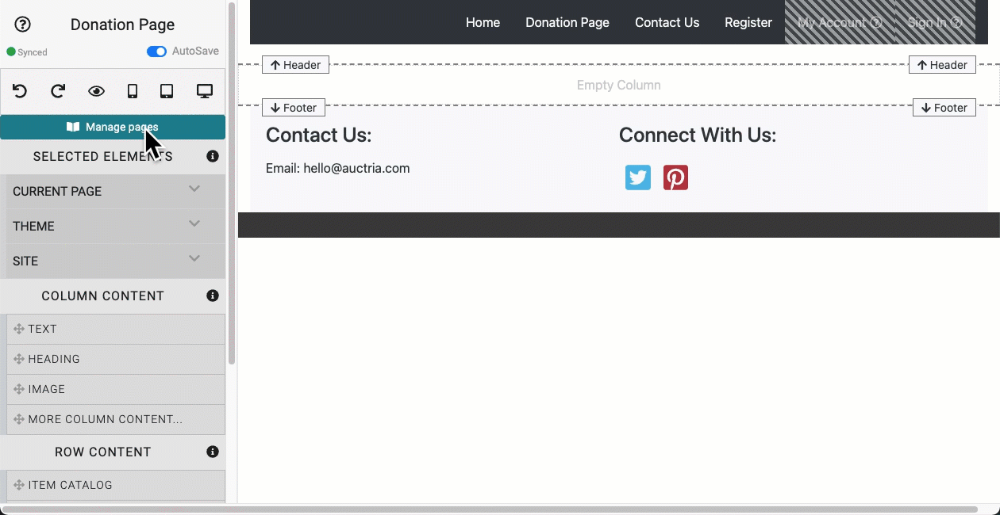
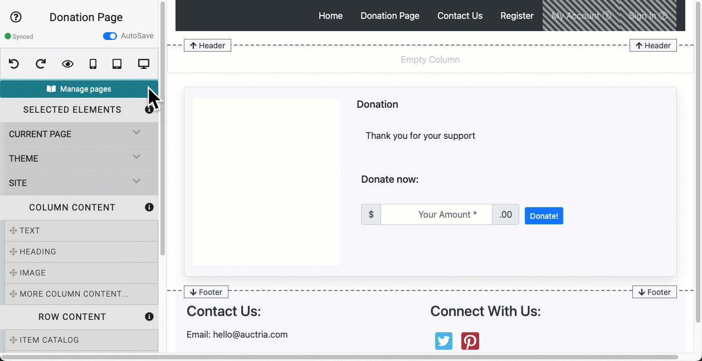
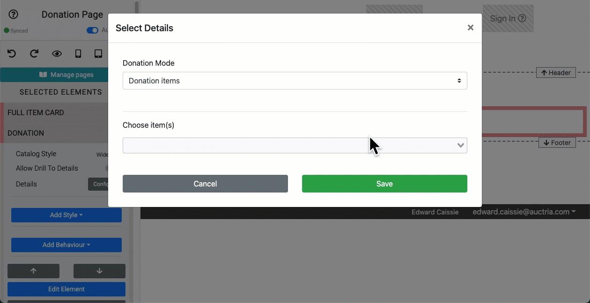

# How To Add A Donation Page <New/>

::: middle
*An example showing a simple "Donation Page" from a demo auction.*
:::

When you first start with Auctria, one of the things you will need to do is create an auction website for your event. This will provide you with the basics for your fundraiser's online needs.

This will also provide your guests a place to find you on the internet and, in this case of **How To Add A Donation Page**, be able to make donations to your fundraiser.

::: prereq
- **Auctria Auction Website** (see <IndexLink slug="Walkthroughs_CreateNewWebSite2021"/> if needed)
:::

::: info
Many of the website templates already include a default "cash" donation page although this may not suit your needs; below, we will go over **How To Add A Donation Page** to any Auctria website.
:::

## Creating A New Page (Optional)

::: middle
*An quick passthrough creating a new "blank" __Donation Page__.*
:::

In many cases, a new "Donation Page" will start by **Adding A New Page** to the auction website. To add a new page, start by opening the auction website in edit mode.

In the **Website Editor Sidebar** you will find, near the top of the sidebar, the **Manage Pages** bar. Click on this and scroll down in the pop-up window, if necessary, to find the **Add New Page** feature at the bottom of the pop-up window.

Type the name of your "Donation Page" into the text field and click on the **Add New Page** button. This will start the process of adding a new page to the auction website and automatically add a menu entry for the page at the end of the displayed page links. (See "Configure Menu Entries" to change this order as needed.) As part of the new page creation process you will have the option to use a "Pre-built Section" and in this case there is a pre-built section for a "Cash Donation" with a progress tracker (thermometer) available.

If all you need is a "Cash Donation" and a tracker for it on the page, you're all done! Now, if you are looking for something more complex such as a Donation Page with multiple projects you are trying to fund with your fundraiser and you want to ensure each donation pledge is properly associated with its project you will need to do more... this often is done most easily by starting with a "blank" page.

When you start the **Add New Page** process you could simply stick with the "Basic Sections" tab and select the "1 column" option. This will create a simple page for the auction website which you will need to fill in. You can come back to this page and update it at any time.

<Link/> <IndexLink slug="AddNewWebsitePage"/>
<Link/> <IndexLink slug="WebsiteEditorSidebar"/>

## Creating Donation Items

In many cases, especially if you are having a single event raising funds for multiple projects, you will need to create **Donation** items to highlight each project and allow your donating bidders the option to choose the project, or projects, they would like to help fund.

For more information on creating **Donation** items, you will need to start by creating new items with the **Donation** item type. For more information on creating **Donation** items, **please read** the following pages in the User Guide:
- <IndexLink slug="AddNewItem"/>
- <IndexLink slug="DonationItems"/>
- <IndexLink slug="SettingDonationLevels"/>

Once you have your **Donation Items** created and ready to be offered to your guests, return to that "Donation Page" you created where we will add a **Donation Element** using the "Donation Items Mode" and these items you just created.

<Link/> <IndexLink slug="AddNewItem"/>
<Link/> <IndexLink slug="DonationItems"/>
<Link/> <IndexLink slug="SettingDonationLevels"/>
<Link/> <IndexLink slug="RowContent_DonationElement"/>

## Adding A Donation Element To A Page

::: middle
*An quick passthrough adding the __Donation Element__ to the "blank" __Donation Page__.*
:::

Although this is about **How To Add A Donation Page** you can add **Donation Elements** to any page... or have multiple instances of **Donation Elements** across several pages on your auction website.

::: ideas
You can also add your new **Donation Items** to your auction catalog, too, please see <IndexLink slug="AddDonationItemsToCatalog"/> in the **User Guide** for more information on this approach.
:::

To add a **Donation Element** to a page you may need to add a new **Row Element** although if we are following from the processes above you can drag-n-drop the **Donation** element into the empty Row/Column that was created when you added the new page to the website.

::: info
This will actually add a row (either above or below) the existing empty row/column just make sure to drag the **Donation** element onto the existing column and then drop it when you see the new row appear. Dropping the element below is relevant in this case although empty rows/columns are not displayed to auction website visitors.
:::

Once you have inserted the **Donation** element it will default to the "Cash Donation Mode". If you are going with the "Donation Items Mode" you will need to edit the **Donation** element and change its "Donation Mode" setting to "Donation Items".

<Link/> <IndexLink slug="RowContent_DonationElement"/>
<Link/> <IndexLink slug="DonationItems"/>
<Link/> <IndexLink slug="AddNewRow"/>

### Using The Donation Items Mode

::: middle
*An quick passthrough changing of the __Donation Element__ to "Donation Items" mode.*
:::

To change the **Donation** element to "Donation Items" mode, edit the **Donation Element** in the pop-up window and change the drop-down selector to "Donation Items". You can now select the **Donation Items** you created earlier for the projects you want to fund. You can select a single item, or multiple items, each is added individually to the element in the pop-up window.

::: middle
*An example quick passthrough selecting "Donation Items" from demo data.*
:::

Once you have selected your **Donation Items** you can click on the "Save" button to add them to the element's display.

::: ideas
If you have an existing **Donation Element** in **_Cash Donation Mode_**, the above can be followed to change the **Donation Element** to use **_Donation Item Mode_**.

You can even add a second **Donation Element** along side (above or below in reality) an existing **Donation Element**, there is no restriction on the number of these website elements you can add to your site.
:::
&nbsp;
<Link/> <IndexLink slug="DonationItems"/> <Link/> <IndexLink slug="RowContent_DonationElement"/> | <IndexLink slug="RowContent_DonationElement" anchor="donation-items-mode"/>

## Finishing The Donation Page

::: middle
*An example showing a simple "Donation Page" from a demo auction.*
:::

It's important to note that starting with a "blank" page may leave some possible "missing" elements. You might consider some additional content on the page such as a page title, or **Heading**, some general information about the donation projects not covered in the **Donation Item** descriptions, and maybe a **Progress Tracker** sharing how well you are doing.

To add a page title, and keeping in mind you dropped the **Donation Element** below the existing empty row/column on the page, you can "drag-n-drop" the **Heading** element into that *Empty Column*. Once you drop the **Heading Element** into the empty column it will display with the default text "Heading Text" -- just double-click on the text to open its **Edit Text** window and change the default to a more appropriate title for the page; click **Update** when you are finished.

**_NOTE_**: Adding a **Text Element** and/or a **Progress Tracker** may require you **Add A New Row**

<Link/> <IndexLink slug="DonationItems"/>
<Link/> <IndexLink slug="BasicContent_Heading"/>
<Link/> <IndexLink slug="AddNewRow"/>
<Link/> <IndexLink slug="BasicContent_Text"/>
<Link/> <IndexLink slug="BasicContent_Thermometer"/>

You're done! Good Job!!

Now, just click on the "eye" icon at the top of the <IndexLink slug="WebsiteEditorSidebar"/> and have a look at the new "Donation Page" you just created.

Well Done!

<ChildPages/>
<Revised text="Added" date="2021-10-19"/>
