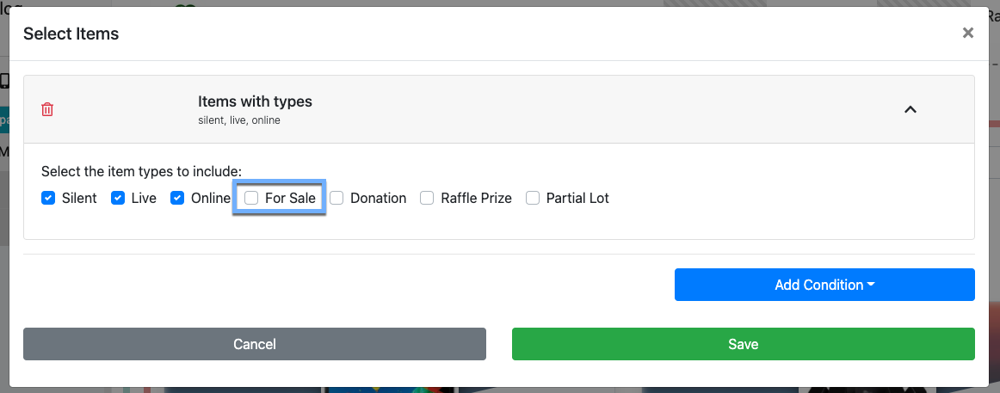

# How To Add Raffle Tickets <Updated/>

::: red
**Auctria only provides the means to sell "lots" that represent the "raffle tickets".**
When you **Run A Raffle** using Auctria you will need to have a method to actually assign raffle ticket numbers to bidders as well as pick the winning ticket.
:::

::: prereq
- **Auctria Auction Website** (see <IndexLink slug="Walkthroughs_CreateNewWebSite2021"/> if needed)
:::

<HRDiv/>

  
How To Add Raffle Tickets: Table of Contents

  [[toc]]

<HRDiv/>

## Create Raffle Ticket

**Raffle Tickets** are best created as <IndexLink slug="ForSaleItems"/>, where you can set a number of tickets to be available and the price of each ticket is set in the **For Sale Item** *Value* field.

It is **strongly recommended** to use the *RAFFLE* tag on your **Raffle Ticket** items to assist with other related features (see [Use Raffle Tickets Section](./#use-raffle-tickets-section) below).

::: middle
*An example of a minimal __Raffle Ticket__ item before saving.*
:::

You have the option to let the system automatically provide an **Item #**; or, you can optionally choose to set an item number such as *Raffle_Ticket*.

Using a custom item number might allow you to provide participants with a direct URL such as, in this case, https://charity.bids/demo/raffle_ticket... just make certain to use a **web-friendly** item number if you want to use this approach.

If you have a limited number of **Raffle Tickets** available, you can set that *Quantity* in the **For Sale Items** section either when creating the item; or, you can <IndexLink slug="EditItemDetails"/> later to set the quantity.

You can also add an image related to your **Raffle Ticket** during the item creation or afterward by editing the item details. See <IndexLink slug="ItemDetailsImagesAndLinks"/> for more information on this.

### Create Raffle Ticket Books

If you want to sell multiples of a **Raffle Ticket** (and often at a discounted price), for example you sell your single **Raffle Ticket** for `$5.00` but also want to sell `4 for $15.00`. You can do this easily by creating a second item, for example, **Raffle Tickets** to work as your "book of tickets", "ticket package", "multi-ticket item", etc. raffle ticket item.

The key to this approach is to enable the **Is basket lot/package?** property in the *Options* panel of the Item. This can be done during item creation or you can enable the property afterward. This is also required in order to connect the single ticket with the item representing multiple tickets.

Enabling the **Is basket lot/package?** property adds the **Contents** tab to the item details page for the specific item (see <IndexLink slug="Baskets"/> for more details about this feature set).

Under the **Contents** tab you will use the *Include for sale items* section to include the single **Raffle Ticket** at the appropriate quantity...

::: middle
*From an example multiple tickets __Raffle Ticket__ item.*
:::

::: middle
*Following the example of selling `4 for $15.00`.*
:::

::: yellow
**IMPORTANT**
Since the multiple ticket **Raffle Tickets** item uses the single ticket **Raffle Ticket** item you can set an available quantity for the single ticket and Auctria will manage an appropriate limit on the number of multiple ticket sales that can be made.
:::

## Display Raffle Tickets

There are a few different approaches that can be taken to display your **Raffle Ticket** items, the most common being in a stand-alone page or including them within other auction catalogs.

### Use Raffle Tickets Section

The easiest approach for a stand-alone page is to use the **Add New Page** function...

::: middle
*An example of a __new__ page being added for __Raffle Tickets__.*
:::

...and select the **Pre-built Section** for **Raffle Tickets**.

::: middle
*The __Pre-built Section__ tab with the __Raffle Tickets__ section highlighted.*
:::

::: red
**WARNING**
This approach uses the recommendation **Raffle Ticket** items have the `RAFFLE` tag applied to them. This recommendation is best practice when creating **_Raffle Tickets_** to help with display, organization, reporting, etc.
:::

::: middle
*An example page using the __Raffle Tickets__ pre-built section and a demo event.*
:::
&nbsp;

<Link/> <IndexLink slug="AddNewWebsitePage"/>
<Link/> <IndexLink slug="Section_AddSection"/>
<Link/> <IndexLink slug="Section_AddSection" anchor="raffle-tickets">Add Section | Raffle Tickets</IndexLink/>

### Include In Auction Catalog

By default, most auction catalogs have a default condition configuration that only displays "biddable" items (<IndexLink slug="Glossary_BiddableItems"/>), to include your **Raffle Tickets** in your auction catalog you may be able to simply adjust the current condition to include **For Sale** items.

::: middle
*An example of a default "biddable" item only auction catalog __Condition__ setting.*
:::

See the <IndexLink slug="ConfigureItemsDisplayed"/> page as well as the FAQ <IndexLink slug="ItemsNotShowing"/> for more information on this.

### Include With Admission Tickets

It may be a case where you want to provide your participants with the opportunity to purchase their **Raffle Tickets** when they are purchasing other <IndexLink slug="Tickets"/> items (those generally representing in-person event admission or similar needs).

You can configure your **Raffle Ticket** to be included with your **Tickets** items by enabling its *For Sale Items* property **Show in default web purchase element**. This will then add the **Raffle Ticket** into the same catalog used in the most common approach for displaying "admission" tickets for sale.

With the above option enabled for the **Raffle Ticket** it would now be displayed appropriately on the **Tickets** page (when using the pre-built <IndexLink slug="Section_AddSection" anchor="ticket-sales"/> section).

::: middle
*An example __Tickets__ page with both __Raffle Tickets__ and __Admission Tickets__ in the same catalog.*
:::

<HRDiv/>

## Raffle Ticket Sales Not Allowed <Advanced/>

There may be cases where local legislation does not allow for **Raffle Tickets** to be sold online although you still want to "advertise" your fundraiser will be having a "draw" at the "in-person" event. You might consider using the **Raffle Prize Items** type to accomplish this.

**Raffle Prize Items** are **_display only_** meaning they **_cannot be sold_**.

The **Raffle Prize Items** can be used to describe what each raffle draw would be for, such as the actual prize or the goals the raffle is targeted to help.

You would create the **Raffle Prize Items** in a very similar method as described [above](./#create-raffle-ticket) using the **Raffle Prize** type instead of the **For Sale** type. It is also still a very good idea to use the *RAFFLE* tag on these items so you can continue with displaying them as though you were displaying the **Raffle Tickets**.

::: middle
*An example of a __Raffle Prize__ item being created.*
:::

::: info
You may still want **Raffle Tickets** in your fundraiser for recording their specific sales. It would be best, if this is the case, to use their respective **Exclude from catalog** option so these items are **_not_** displayed on the **Auction Website**.
:::

<Link/> <IndexLink slug="RaffleItems"/>

<ChildPages/>
<Revised date="2022-01-07"/>
