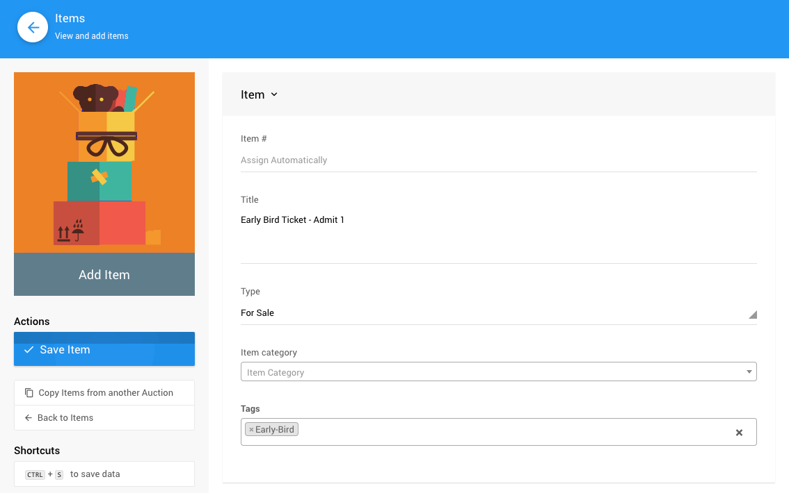
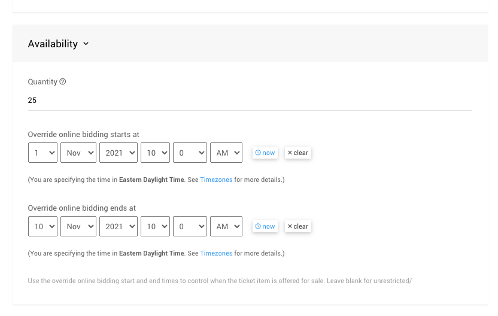
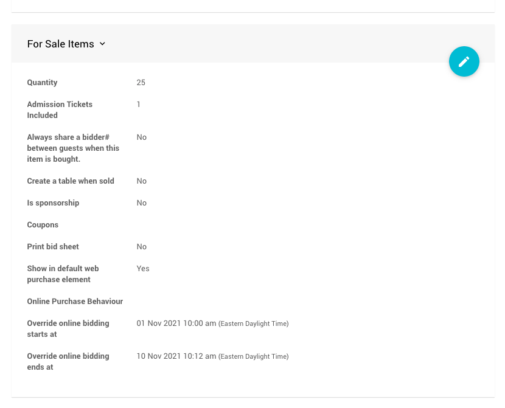
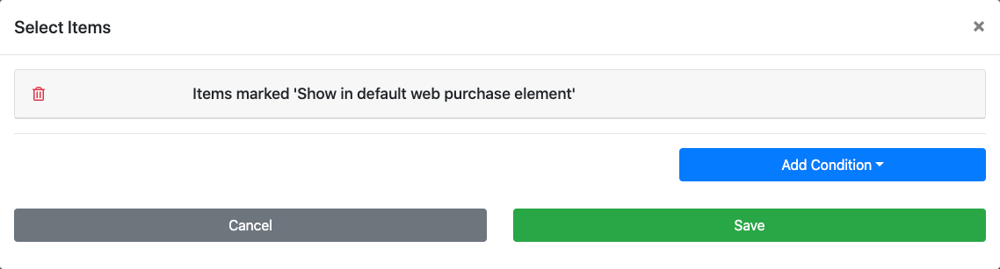
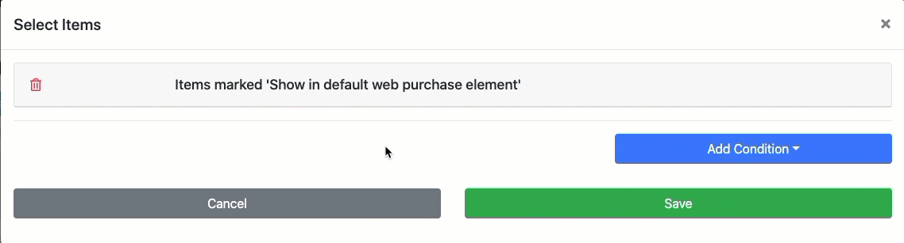
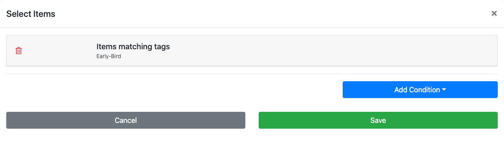

# How To Add Early Bird Tickets <Updated/> <NewLoc/>

**Early Bird Tickets** are often sold before the "regular" in-person event **Tickets** are sold.

::: red
**WARNING**
**_Ticket Items_** should **only** be used for **event admissions** and other similar *gate-keeping* measures. Please **do not enable** this feature set for items that represent other kinds of "tickets", such as raffle tickets, drink tickets, etc.
:::

In most cases, when adding **Early Bird Tickets** you will want to create a **Tickets** item with relevant availability and quantity (if necessary) values as well as display these tickets in an **Item Catalog**.

::: prereq
- **Auctria Auction Website** (see <IndexLink slug="Walkthroughs_CreateNewWebSite2021"/> if needed)
:::

<Link/> <IndexLink slug="Tickets"/> <Link/> <IndexLink slug="RowContent_ItemCatalog"/>

## Create Tickets

In general, creating an **Early Bird Ticket** will be no different than creating a "regular" ticket. See <IndexLink slug="CreateTickets"/> for more information on creating ticket items.

You will need to set an appropriate value for the **Admission Tickets Included** and, if necessary, the number of tickets available in the **Quantity** field if you plan to limit the number of **Early Bird Tickets** that will be available. You will also need to set the the **Override online bidding** (both the start and end will need to be set).

When creating the **Early Bird Tickets** you should also consider how you will be identifying these ticket items to differentiate them from other ticket items you will be using for your regular tickets. One method to consider for this is using the <IndexLink slug="Tags"/> feature and assign a tag to these ticket items.

### Set Availability

Part of creating an **Early Bird Ticket** includes setting the ticket **Availability**. This can be done as the ticket item is being created.

::: middle
*An example setting a limit of __25__ tickets to be sold from __Nov. 1, 2021 to Nov 10, 2021__.*
:::

::: info
Once the ticket has been saved, it can be edited in the <IndexLink slug="ForSaleItemsDetailed" anchor="for-sale-items"/> section of the item. For example, the below shows the settings for **25** **single-entry** tickets available for purchase from **Nov. 1, 2021** until **Nov. 10, 2021**.

::: middle
*An example showing the override start and end times from above.*
:::

<HRDiv/>

## Display Tickets

Once the **Early Bird Tickets** are created and have their appropriate options set you can then proceed to make the tickets available using the <IndexLink slug="RowContent_ItemCatalog"/> element.

One method to do this is to create a new <IndexLink slug="Section_AddSection" anchor="ticket-sales"/> page, although it will require an easy adjustment to its conditions. The default **Pre-Built Section - Ticket Sales** page is pre-configured for the most common approach to selling tickets.

### Create And Configure A New Ticket Sales Page (Optional)

See <IndexLink slug="AddNewWebsitePage"/> to get started with creating the **Ticket Sales** page and follow the prompts to use the <IndexLink slug="Section_AddSection" anchor="ticket-sales"/> **Pre-Built Section**.

The next steps involve using the **Select Items** property of the **Item Catalog** (see <IndexLink slug="ConfigureItemsDisplayed"/>) to change the default *condition* used for the **_Ticket Sales_** **Item Catalog**.

::: middle
*A quick passthrough using the __Items matching tags__ condition set to "Early-Bird".*
:::

Once the condition has been changed, you should see the following for the specific **Item Catalog** options using the example `Early-Bird` **Tag** from above.

<HRDiv/>
&nbsp;

::: ideas
If you already have an existing **Tickets Page** and want to use it instead of creating a new **Early Bird Tickets** page, you can simply adjust its display conditions and change them back later as needed. See <IndexLink slug="ConfigureItemsDisplayed"/> for more details on this.

You do not need to create a new page for your **Early Bird Tickets**. If it works better for your needs you can just add an appropriately configured **Item Catalog** (or **Pre-built** section) where you feel it best fits your auction website.

<Link/> <IndexLink slug="RowContent_ItemCatalog"/> <Link/> <IndexLink slug="Section_AddSection" anchor="ticket-sales">Add Section  - Ticket Sales</IndexLink>
&nbsp;
:::

<ChildPages/>
<Revised date="2021-11-01"/>
