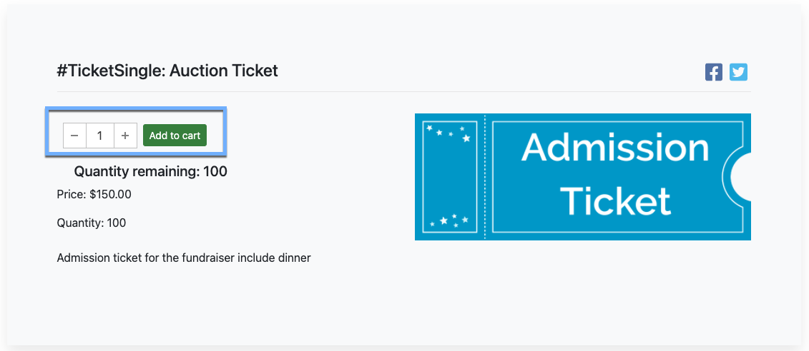

# How To Sell Ticket Bundles <New/>

A fairly common occurrence for in-person events is to **Sell Ticket Bundles**. This is often either more than one of the single admission **Tickets** item or a package of **Tickets** consisting of multiple single admission **Tickets** items (and possible other swag like items).

::: prereq
- **Auctria Auction Website** (see <IndexLink slug="Walkthroughs_CreateNewWebSite2021"/> if needed)
- A single admission **Tickets** item.
:::

::: recread
- See <IndexLink slug="CreateTickets"/> to create your admission **Tickets** items.
- See <IndexLink slug="Baskets"/> to review how to create a **_package_** item.
- Review <IndexLink slug="EarlyBirdTickets" anchor="display-tickets"/> from the **How To Add Early Bird Tickets** walkthrough.
:::

<HRDiv/>

  
How To Sell Ticket Bundles: Table of Contents

  [[toc]]

<HRDiv/>

## Packaging Tickets

If you are planning to go the **_package_** route of selling multiple **Tickets** per transaction, or including something other than **Tickets** with your package, you may need to create a **Basket** item to represent the package of items.

If you want to sell multiples of **Tickets** (and often at a discounted price), for example you sell your single admission **Tickets** for `$150.00` each but also want to sell a `Table of 8 for $1000.00`. You can do this easily by creating a second item, for example, **Table of 8 Tickets** to work as your "bundle", "ticket package", "multi-ticket item", etc. with the appropriate number admissions set in its details.

If it is also important to manage the number of tickets available, the key is to enable the **Is basket lot/package?** property in the *Options* panel of the **_ticket package_** item. This can be done during item creation or you can enable the property afterward. This is also required in order to connect the single ticket with the item representing multiple tickets.

Enabling the **Is basket lot/package?** property adds the **Contents** tab to the item details page for the specific item (see <IndexLink slug="Baskets"/> for more details about this feature set).

Under the **Contents** tab you will use the *Include for sale items* section to include the single **Tickets** item at the appropriate quantity.

::: middle
*From an example __Table For 8__ Tickets item.*
:::

::: info
In this example, since the multiple **Tickets** item uses the single **Tickets** item you can set an available quantity for the **_single_** **Tickets** item and Auctria will manage an appropriate limit on the number of **_multiple_** **Tickets** item sales that can be made.
:::

::: yellow
**IMPORTANT**
The <IndexLink slug="Tickets" anchor="maximum-number-of-tickets-to-sell-across-all-ticket-items"/> property, if set, will take precedence over **Basket** item content quantity limits. This is often the best approach.
:::

::: ideas
Not only can multiple **Tickets** be added to the package, you can also add any additional items that may be suitable as well. There may be swag or special items only for groups of participants, etc.
:::
&nbsp;

<Linked slug="Tickets"/>
<Linked slug="Baskets"/>

<HRDiv/>

## Single Admission Quantity Website Purchase

The other option to **Sell Ticket Bundles** is to simply let your guests purchase multiples of the single admission **Tickets** item. You can also have an organizer use the **Sell Tickets** function and set an appropriate quantity as needed.

::: middle
*An __Auction Website__ example single __Tickets__ item with a quantity selector.*
:::

<HRDiv/>

## Auction Dashboard Quantity Tickets Purchase

As an example, you have a **Table For 8** but a VIP group has asked to have a "Table For 9" added for them. You can use the **Sell Tickets** function to sell the group the `9` **Tickets** items.

::: middle
*An example of using the __Sell Tickets__ function for `9` admission __Tickets__.*
:::

Next, use the **Add A Table** function to create their table.

::: middle
*An __Add Table__ dashboard based on the above scenario.*
:::

For more information about <IndexLink slug="TablesAndSeating"/> see the section under **Bidders** in our User Guide.

::: blue
In some cases, you may need to find a "work-around" to accomplish what you need. Most are fairly simple although may involve a few steps.
:::
&nbsp;

<Linked slug="SellTickets"/>
<Linked slug="TablesAndSeating" anchor="add-a-table"/>

<ChildPages/>
<Revised text="Added" date="2022-02-17"/>
